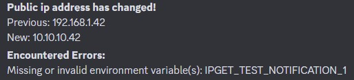

# IPget Docker

## Table of Contents

- [IPget Docker](#ipget-docker)
  - [Table of Contents](#table-of-contents)
  - [About](#about)
  - [Usage Configuration](#usage-configuration)
    - [Database Configuration](#database-configuration)
      - [Using SQLite](#using-sqlite)
    - [Logging \& Monitoring](#logging--monitoring)
      - [Healthchecks](#healthchecks)
      - [Discord Notifications](#discord-notifications)
  - [Licence](#licence)

## About

A simple, containerised Python script, that gets the system's current public IPv4 address using [ident.me](https://api.ident.me) and records it to a MySQL/SQLite database.
Optionally, sends a Discord notification via webhook, and pings [healthchecks.io](https://healthchecks.io/).

## Usage Configuration

All configuration is done through environment variables. Most values are required, but some have default values that will be used if the environment variable is not specified.
Docker-compose files containing [SQLite](docs/sqlite-example-compose.yaml) and [MySQL](docs/mysql-example-compose.yaml) examples are available in the [docs](docs).

### Database Configuration

| Environment Variable | Required             | Description                                                                   |
| -------------------- | -------------------- | ----------------------------------------------------------------------------- |
| `IPGET_DB_TYPE`      | Allways              | Which database type to use. Must be one of `SQLite`, `MySQL` or `PostgreSQL`. |
| `IPGET_DATABASE`     | `MySQL` `PostgreSQL` | Name of the database to connect to e.g. `public_ip_db`.                       |
| `IPGET_USERNAME`     | `MySQL` `PostgreSQL` | User to connect to the database.                                              |
| `IPGET_PASSWORD`     | `MySQL` `PostgreSQL` | Password for the database user.                                               |
| `IPGET_HOST`         | `MySQL` `PostgreSQL` | Address of the database host e.g. `ip_address`.                               |
| `IPGET_PORT`         | `MySQL` `PostgreSQL` | Port for the database connection.                                             |

#### Using SQLite

For `SQLite`, `IPGET_DATABASE` is the path to the sqlite database file **within the container**, which defaults to `/app/public_ip.db`.
When deploying the container, the path should be configured via docker volume mappings to a persistent location, if it is not, then the database file **will be lost** on container restart!
See the [here](docs/sqlite-example-compose.yaml) for an example docker compose file.

It is generally **not** necessary to modify environment variable configuration for SQLite, these values are intended for use in development e.g. setting the path to `:memory:`, for testing.

### Logging & Monitoring

| Environment Variable | Default | Description                                                                                                                                              |
| -------------------- | ------- | -------------------------------------------------------------------------------------------------------------------------------------------------------- |
| `IPGET_LOG_LEVEL`    | `INFO`  | Log level. Passed directly to the python logging module's [`Logger.setlevel`](https://docs.python.org/3.7/library/logging.html#logging.Logger.setLevel). |

>⚠️ **Note**:
Healthcheck urls (see [Healthchecks](#healthchecks)), including un-redacted uuids, etc. will be included in `DEBUG` level logging output.

#### Healthchecks

| Environment Variable       | Default               | Description                                                                                                             |
| -------------------------- | --------------------- | ----------------------------------------------------------------------------------------------------------------------- |
| `IPGET_HEALTHCHECK_SERVER` | `https://hc-ping.com` | Server to send pings to, default will use [healthchecks.io](https://healthchecks.io).                                   |
| `IPGET_HEALTHCHECK_UUID`   | None                  | Check UUID to ping. Slug based pings are not supported. If left unspecified, healthchecks integration will be disabled. |

#### Discord Notifications

If a discord webhook is given, then notifications will be sent every time the detected IP address changes, or if the script encounters errors.

| Environment Variable    | Default | Description                                                                                            |
| ----------------------- | ------- | ------------------------------------------------------------------------------------------------------ |
| `IPGET_DISCORD_WEBHOOK` | None    | Discord webhook to use for notifications. If left unspecified, Discord notifications will be disabled. |

## Licence

[MIT](LICENCE.txt)
